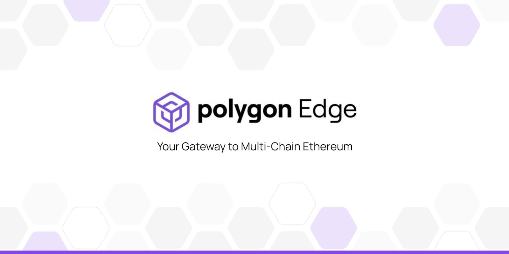

## Daoc  

Daoc   is a modular and extensible framework for building Ethereum-compatible blockchain networks.

To find out more about Daoc, visit the [official website](https://Daoc.technology/).

WARNING: This is a work in progress so architectural changes may happen in the future. The code has not been audited yet, so please contact [Daoc   team](mailto: @Daoc.technology) if you would like to use it in production.

## Documentation 📝

If you'd like to learn more about the Daoc  , how it works and how you can use it for your project,
please check out the **[Daoc   Documentation](https://docs.Daoc.technology/docs/ /overview/)**.

---

Copyright 2022 Daoc Technology

Licensed under the Apache License, Version 2.0 (the "License");
you may not use this file except in compliance with the License.
You may obtain a copy of the License at

       http://www.apache.org/licenses/LICENSE-2.0

Unless required by applicable law or agreed to in writing, software
distributed under the License is distributed on an "AS IS" BASIS,
WITHOUT WARRANTIES OR CONDITIONS OF ANY KIND, either express or implied.
See the License for the specific language governing permissions and
limitations under the License.
